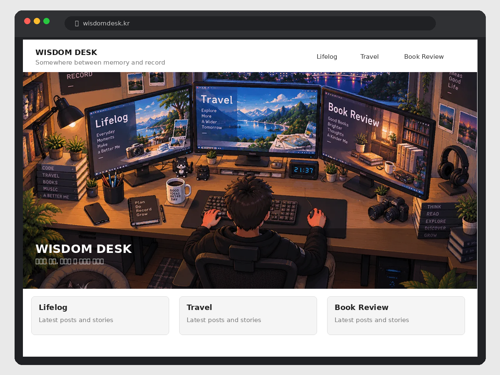

# Wisdom Desk WordPress Theme

티스토리 감성 스킨을 기반으로 워드프레스의 유연성과 최신 웹 표준 기술을 결합하여 제작된 블로그 테마입니다.  
아늑한 데스크 일러스트와 풍부한 마이크로 인터랙션, 모바일 친화적인 반응형 UI를 제공합니다.

---

## ✨ 주요 기능 (Key Features)

### 1. 🖥️ 인터랙티브 데스크 프론트 페이지 (`front-page.php`)

- **3개 모니터 카테고리 링크**: 일러스트 속 원근감이 적용된 3개 모니터(라이프로그, 여행, 북리뷰)에 마우스를 올리면 네온 글로우 효과가 나타나며 클릭 시 해당 카테고리로 부드럽게 이동합니다.
- **☕ 모락모락 피어오르는 커피 김(Steam) 애니메이션 (v1.5.0)**: 머그컵 입구에서 자연스럽게 피어오르는 3가닥의 스팀과 은은한 온기 베이스가 순수 CSS GPU 가속 및 SVG 블러 필터로 생생하게 작동합니다.
- **100% 반응형 SVG 오버레이**: 1536×1024 viewBox 기반으로 설계되어 스마트폰부터 대형 모니터까지 화면 크기가 변해도 모니터 화면 및 머그컵 위치에 정확히 고정됩니다.
- **모바일 퀵 바로가기 바**: 작은 화면에서도 편리하게 주요 카테고리에 접근할 수 있는 직관적인 내비게이션 버튼을 제공합니다.
- **몰입감 높은 독립형 랜딩**: 프론트 페이지에서는 상단 GNB와 중복 배너를 배제하여 일러스트 본연의 아늑한 분위기에 시선을 집중시킵니다.

### 2. 📱 감성적인 모바일 드로어(서랍) 사이드바

- **배너 배경 프로필 카드 (v1.4.9)**: 모바일 서랍 상단 프로필 영역에 메인 배너 썸네일(`images/main-banner.jpg`)과 반투명 오버레이를 적용하여 완성도 높은 감성 디자인을 구현했습니다.
- **카테고리 글 수 표기**: 대분류 및 소분류 카테고리별 글 수를 `( )` 괄호 형태로 직관적이고 깔끔하게 표시합니다.

### 3. 🧭 부드러운 2-Depth 메가메뉴

- **호버 브릿지(Hover Bridge)**: 상단 메뉴 버튼에서 하위 메가메뉴로 마우스가 이동할 때 깜빡임이나 끊김 현상이 발생하지 않도록 부드러운 연결 영역을 구현했습니다.
- **일관된 레이아웃 폭**: 메인 페이지뿐만 아니라 글 상세 페이지에서도 메가메뉴 폭이 안정적으로 유지됩니다.

### 4. 📖 가독성에 집중한 글 상세 페이지

- **컴팩트 슬림 헤더 배너 (158px / 모바일 130px)**: 과도한 여백을 줄여 사용자가 페이지 진입 즉시 본문 콘텐츠를 읽을 수 있도록 최적화했습니다.
- **다양한 독서 보조 모듈**: 해당 카테고리의 최신글 사이드 위젯, 태그 클라우드, 관련글 추천, 댓글 작성 폼을 기본 지원합니다.

---

## 🚀 설치 및 설정 방법

1. **테마 설치 및 활성화**
   - 이 폴더를 zip으로 압축하여 워드프레스 관리자 → **외모 → 테마 → 새로 추가 → 테마 업로드**로 설치하거나, 서버의 `wp-content/themes/` 디렉터리에 업로드 후 활성화합니다.
2. **상단 카테고리 메뉴(GNB) 설정**
   - **외모 → 메뉴**에서 새 메뉴를 만든 후 "상단 카테고리 메뉴(GNB)" 위치에 할당하세요. (메뉴를 연결하지 않으면 기본 카테고리가 자동으로 출력됩니다.)
3. **사이드바 위젯 구성**
   - **외모 → 위젯**에서 "사이드바" 영역에 태그 구름, 최근 댓글, 보관함(Archives), 달력 위젯 등을 배치하세요. (프로필과 카테고리 목록은 기본 내장되어 상단에 자동 출력됩니다.)
4. **홈페이지(프론트 페이지) 설정**
   - **설정 → 읽기**에서 홈페이지 표시 방식을 "최신 글"로 유지하면 인터랙티브 데스크 화면(`front-page.php`)이 메인 화면으로 자동 표시됩니다.

---

## 📁 주요 파일 구성

| 파일/디렉터리 | 설명 |
| :--- | :--- |
| `front-page.php` | 인터랙티브 데스크 일러스트 & 모니터 링크 & 커피 스팀 애니메이션 프론트 페이지 |
| `style.css` | 테마 메타 정보, 반응형 스타일시트, 모니터 글로우 및 스팀 애니메이션 정의 |
| `functions.php` | 테마 셋업, 위젯/메뉴 등록, 헬퍼 함수, 카테고리 자동 매핑 로직 |
| `header.php` / `footer.php` | 헤더(로고, 검색, GNB, 메인 배너) 및 푸터 구조 |
| `sidebar.php` | 프로필 카드, 계층형 카테고리 트리, 사이드바 위젯 컨테이너 |
| `index.php` / `archive.php` | 블로그 카드형 글 목록 및 카테고리/태그 아카이브 템플릿 |
| `single.php` / `page.php` | 글 상세 페이지(슬림 배너, 카테고리 최신글 사이드바) 및 고정 페이지 |
| `comments.php` | 반응형 댓글 목록 및 작성 폼 |
| `images/frontpage.webp` | 프론트 페이지용 고해상도 데스크 일러스트 (1536×1024) |
| `images/main-banner.jpg` | 메인 헤더 및 모바일 서랍 프로필 배경용 배너 이미지 |
| `inc/class-tistory-style-nav-walker.php` | 2-Depth 메가메뉴 마크업 전용 커스텀 내비게이션 워커 |
| `js/theme.js` | 모바일 서랍 사이드바 토글 및 메가메뉴 높이 계산 스크립트 |
| `CHANGELOG.md` | 버전별 상세 변경 이력 기록 문서 |

---

## 🛠️ 브라우저 및 호환성

- **지원 브라우저**: Chrome, Safari, Edge, Firefox 등 모든 모던 웹 브라우저
- **CSS 기술**: 순수 CSS3 (GPU 가속 `transform`, `opacity`, `filter`, `aspect-ratio` 기반)
- **요구 사양**: WordPress 6.0 이상, PHP 7.4 이상
